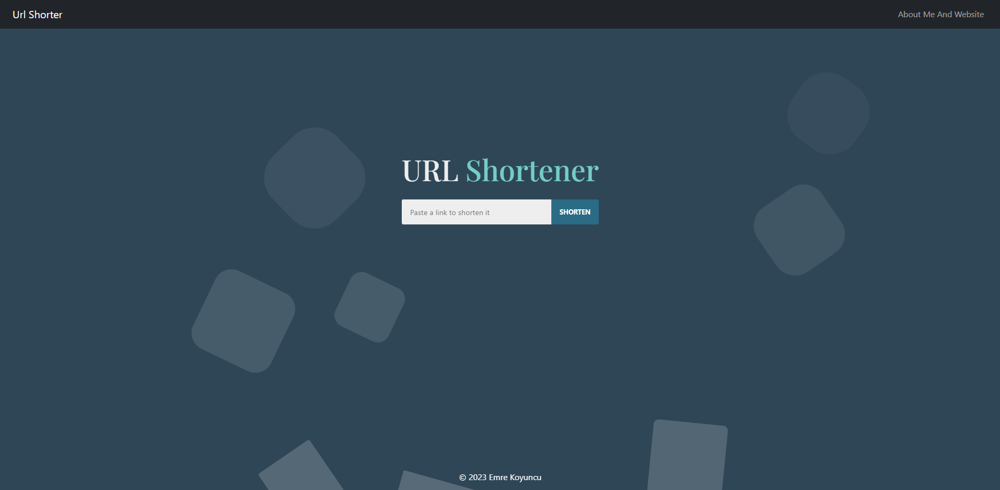

  <h1 align="center">URL Shortener App</h1>

  

    A simple and efficient URL shortening application built with React.js
     
    
     
     
    <a href="https://github.com/emrekoyuncuu/UrlShortenerApp/issues">Report Bug</a>
    ·
    <a href="https://github.com/emrekoyuncuu/UrlShortenerApp/issues">Request Feature</a>
  

  

    
    
    
    
  

 

## 📋 Table of Contents

- [📋 Table of Contents](#-table-of-contents)
- [🚀 About The Project](#-about-the-project)
  - [Key Features](#key-features)
- [🛠️ Built With](#️-built-with)
- [🏁 Getting Started](#-getting-started)
- [💻 Usage](#-usage)
- [🗺️ Roadmap](#️-roadmap)
- [🤝 Contributing](#-contributing)
- [📧 Contact](#-contact)
- [🙏 Acknowledgements](#-acknowledgements)

## 🚀 About The Project

  
  
<em>URL Shortener Interface</em>

URL Shortener App is a web application that allows users to create shortened versions of long URLs. Built with React.js, it provides a simple and intuitive interface for quickly generating and copying short links. This project demonstrates the implementation of API integration, state management, and responsive design in a React application.

### Key Features

- 🔗 **Quick URL Shortening**: Instantly create short links for long URLs
- 📋 **Copy to Clipboard**: One-click copying of shortened URLs
- 🌐 **API Integration**: Utilizes a reliable URL shortening service
- 📱 **Responsive Design**: Optimized for both desktop and mobile devices
- 🎨 **Clean UI**: User-friendly interface with intuitive design
- 🔄 **Input Validation**: Ensures valid URL inputs for reliable shortening

## 🛠️ Built With

This project is created using these technologies:

- [React.js](https://reactjs.org/)
- [JavaScript](https://developer.mozilla.org/en-US/docs/Web/JavaScript)
- [CSS3](https://developer.mozilla.org/en-US/docs/Web/CSS)
- [URL Shortening API](https://shrtco.de/docs/)

## 🏁 Getting Started

To get a local copy up and running, follow these simple steps:

1. Clone the repository
   ``sh
   git clone https://github.com/emrekoyuncuu/UrlShortenerApp.git
   ``
2. Navigate to the project directory
   ``sh
   cd UrlShortenerApp
   ``
3. Install dependencies
   ``sh
   npm install
   ``
4. Start the development server
   ``sh
   npm start
   ``
5. Open [http://localhost:3000](http://localhost:3000) in your browser to see the application

## 💻 Usage

1. Enter a long URL in the input field
2. Click the "Shorten" button to generate a short URL
3. Copy the shortened URL with a single click
4. Use the shortened URL to access the original long URL

## 🗺️ Roadmap

See the [open issues](https://github.com/emrekoyuncuu/UrlShortenerApp/issues) for a list of proposed features and known issues.

## 🤝 Contributing

Contributions are what make the open-source community such an amazing place to learn, inspire, and create. Any contributions you make are **greatly appreciated**.

1. Fork the Project
2. Create your Feature Branch (`git checkout -b feature/AmazingFeature`)
3. Commit your Changes (`git commit -m 'Add some AmazingFeature'`)
4. Push to the Branch (`git push origin feature/AmazingFeature`)
5. Open a Pull Request

## 📧 Contact

Emre Koyuncu - [LinkedIn](https://www.linkedin.com/in/emrekoyuncuu/) - emrekoyuncujob@gmail.com

Project Link: [https://github.com/emrekoyuncuu/UrlShortenerApp](https://github.com/emrekoyuncuu/UrlShortenerApp)

## 🙏 Acknowledgements

- [React.js Documentation](https://reactjs.org/docs/getting-started.html)
- [shrtcode API](https://shrtco.de/docs/)
- [Font Awesome](https://fontawesome.com)
- [React Icons](https://react-icons.github.io/react-icons/)
- [Img Shields](https://shields.io)

  Made with ❤️ by <a href="https://github.com/emrekoyuncuu">Emre Koyuncu</a>

